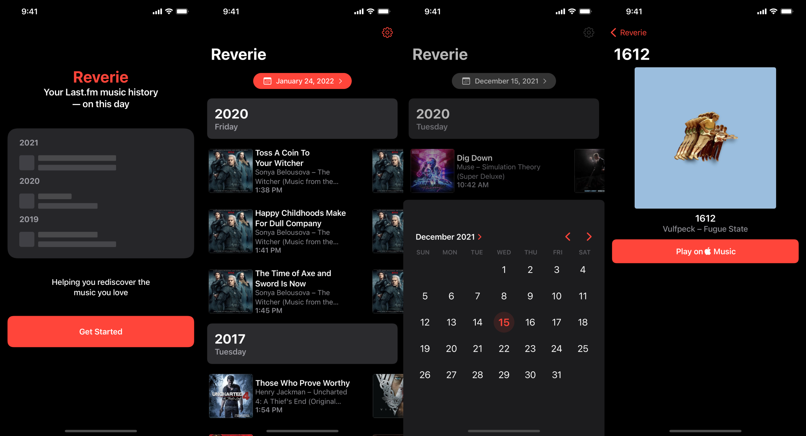

# Reverie

Your Last.fm scrobbles, on this day, in years past.

## About

Reverie is a work-in-progress iOS app that displays your Last.fm scrobbles for each past year, for the current date.

It uses the [Composable Architecture](https://github.com/pointfreeco/swift-composable-architecture) and is written in SwiftUI. It uses Swift Package Manager for dependency management.

## Running the app

- Ensure you have a [Last.fm API key](https://www.last.fm/api/account/create). Before running, edit the 'Reverie' scheme, and set your key as an environment variable with the name `LASTFM_API_KEY`.

## TODO
- [x] Apple Music playback
- [ ] Spotify playback
- [ ] Widgets
- [ ] Push Notifications